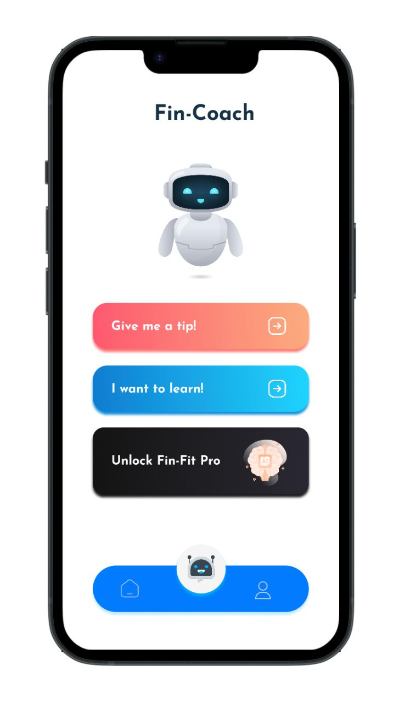
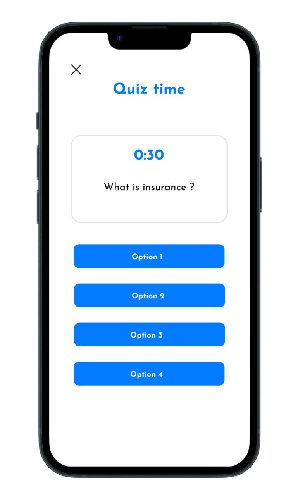
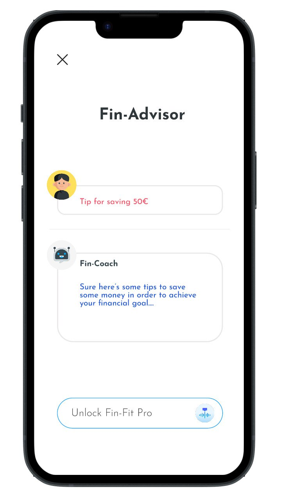
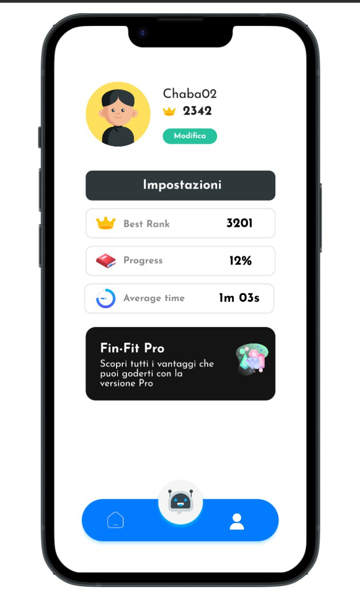
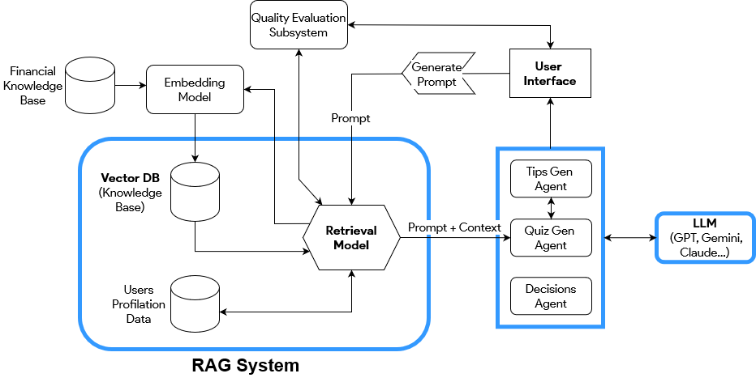

# Fin-Fit

Welcome to Fin-Fit, your personal financial trainer designed to evaluate and enhance your financial knowledge. Powered by the open-source Gemma LLM AI, FinFit is your go-to application for interactive and easy-to-understand content that will test your abilities to navigate the financial world across various domains.

Fin-Fit offers engaging and interactive content designed to enhance your understanding of financial concepts. Whether you're a novice or an expert, FinFit provides tailored learning experiences to suit your level of expertise.

Fin-Fit doesn't just stop at assessments. It also provides personalized advice tailored to your specific financial situation. Whether you're a beginner looking to build a solid financial foundation or an experienced investor seeking advanced strategies, Fin-Fit offers the guidance you need to make informed decisions.

As you progress through Fin-Fit's modules and assessments, the AI-powered platform adapts to your learning style and preferences. This ensures that you're continuously improving your financial knowledge and skills.

## Front-end Mockup

      
     
     
     

## Prototype
https://www.figma.com/proto/nlmhuhnxnNbxp0N3llTnZc/Fin-Fit?type=design&node-id=15-298&t=M2Jka3UMTr6UBLvE-1&scaling=scale-down&page-id=0%3A1&starting-point-node-id=34%3A154&mode=design

## System Design

## Backend Implementation
- Django for backend implementation.
- Gemma on Vertex AI.
- Document-based DB for the financial knowledge (Firestore).
- Structured DB for user data (Cloud DB).